# Design Document

## Overview

This design implements a security-hardened, production-ready CI/CD pipeline using Terraform and GitHub Actions to deploy AWS infrastructure. The architecture follows AWS Well-Architected Framework principles with emphasis on security, reliability, and operational excellence.

The system deploys a multi-tier web application infrastructure with:
- **Edge Protection**: AWS WAF filtering malicious traffic
- **Load Balancing**: Application Load Balancer in public subnets
- **Compute**: EC2 instances in private subnets with security hardening
- **Monitoring**: CloudWatch alarms with SNS notifications
- **Automation**: SSM patch management and CI/CD workflows
- **Cost Control**: Infracost integration with threshold monitoring

## Architecture

### High-Level Architecture Diagram


### Network Architecture

**VPC Design:**
- CIDR: 10.0.0.0/16 (configurable)
- 2 Availability Zones for high availability
- Public Subnets: 10.0.1.0/24, 10.0.2.0/24 (ALB, NAT Gateway)
- Private Subnets: 10.0.101.0/24, 10.0.102.0/24 (EC2 instances)

**Routing:**
- Public subnets route 0.0.0.0/0 → Internet Gateway
- Private subnets route 0.0.0.0/0 → NAT Gateway (in public subnet)
- VPC endpoints for AWS services to reduce NAT usage and improve security

**VPC Endpoints:**
- com.amazonaws.region.ssm (Systems Manager)
- com.amazonaws.region.ec2messages (EC2 Messages)
- com.amazonaws.region.ssmmessages (SSM Messages)

## Components and Interfaces

### 1. Terraform Infrastructure Components

**File Structure:**
```
terraform/
├── versions.tf          # Provider version constraints
├── providers.tf         # AWS provider configuration
├── backend.hcl         # S3 backend configuration
├── variables.tf        # Input variables
├── main_vpc.tf         # VPC, subnets, routing
├── main_security.tf    # IAM, Security Groups, WAF
├── main_compute.tf     # ALB, EC2, Target Groups
├── observability.tf    # CloudWatch, SNS
├── patching.tf         # SSM Patch Management
├── outputs.tf          # Output values
└── terraform.tfvars.example
```

**Key Variables:**
- `project_name`: Resource naming prefix
- `env`: Environment identifier (test/staging/prod/preview)
- `aws_region`: AWS region for deployment
- `cidr_block`: VPC CIDR block (environment-specific)
- `az_count`: Number of availability zones (default: 2)
- `instance_type`: EC2 instance type (varies by environment: t3.micro for test/staging, t3.small+ for prod)
- `allowed_http_cidrs`: CIDR blocks allowed to access ALB
- `enable_preview`: Enable preview environment features
- `kms_key_id`: Optional KMS key for encryption
- `enable_detailed_monitoring`: Enhanced monitoring for staging/prod
- `backup_retention_days`: Backup retention (varies by environment)

### 2. Security Components

**IAM Role for EC2:**
```hcl
# Minimal permissions for EC2 instances
- AmazonSSMManagedInstanceCore (AWS managed)
- CloudWatchAgentServerPolicy (AWS managed)
- Custom policy for application-specific needs
```

**Security Groups:**
- **ALB Security Group**: Ingress HTTP:80 from `allowed_http_cidrs`, Egress to EC2 SG
- **EC2 Security Group**: Ingress HTTP:80 from ALB SG only, Egress HTTPS:443 for updates

**AWS WAF Web ACL:**
- AWS Managed Rules: AWSManagedRulesCommonRuleSet
- AWS Managed Rules: AWSManagedRulesKnownBadInputsRuleSet  
- Rate-based rule: 2000 requests per 5 minutes per IP
- Associated with ALB

**Security Hardening:**
- IMDSv2 required on EC2 instances
- EBS root volume encryption with KMS
- No public IP addresses on EC2 instances
- VPC Flow Logs enabled (optional)

### 3. Compute Components

**Application Load Balancer:**
- Deployed in public subnets across 2 AZs
- HTTP listener on port 80
- Target group with health checks on /
- Deletion protection enabled for production

**EC2 Instances:**
- Amazon Linux 2023 (latest AMI via data source)
- Deployed in private subnets
- User data script installs and configures Nginx
- Instance profile with SSM permissions
- Detailed monitoring enabled

**Target Group Configuration:**
- Protocol: HTTP, Port: 80
- Health check: HTTP:80 on /
- Healthy threshold: 2, Unhealthy threshold: 2
- Timeout: 5s, Interval: 30s

### 4. Monitoring and Alerting

**CloudWatch Alarms:**
- **EC2 StatusCheckFailed**: Triggers when instance status checks fail
- **EC2 High CPU**: Triggers when CPU > 80% for 2 consecutive periods
- **ALB 5xx Errors**: Triggers when 5xx error rate > 5% for 2 consecutive periods

**SNS Configuration:**
- Topic for infrastructure alerts
- Email subscriptions (configured via variables)
- SMS subscriptions (optional)

**Metrics Collection:**
- EC2 detailed monitoring enabled
- ALB access logs (optional, requires S3 bucket)
- VPC Flow Logs (optional)

### 5. Patch Management

**SSM Patch Baseline:**
- Operating System: Amazon Linux 2023
- Patch Classification: Security, Bugfix, Critical
- Auto-approval delay: 0 days for security patches
- Compliance reporting enabled

**Patch Group:**
- Tag-based grouping: `Patch Group = {project_name}-{env}`
- Applied to all EC2 instances

**State Manager Association:**
- Document: AWS-RunPatchBaseline
- Schedule: Weekly (Sundays at 2 AM UTC)
- Targets: Instances with matching patch group tag
- Compliance scanning enabled

## Data Models

### Terraform State Structure

**Remote State Configuration:**
```hcl
# S3 Backend
bucket         = "terraform-state-{account-id}-{region}"
key            = "infrastructure/{project_name}/{env}/terraform.tfstate"
region         = var.aws_region
dynamodb_table = "terraform-state-lock"
encrypt        = true
```

**State File Organization:**
- Environment-specific state files
- Workspace-based separation for preview environments
- State locking via DynamoDB
- Encryption at rest in S3

### Environment-Specific Configurations

**Test Environment:**
- Purpose: Automated testing and validation
- Instance Type: t3.micro
- Monitoring: Basic CloudWatch metrics
- Backup: Optional, 7-day retention
- Auto-scaling: Disabled
- Deployment: Automatic on develop branch push

**Staging Environment:**
- Purpose: Pre-production validation and user acceptance testing
- Instance Type: t3.small (matches production sizing)
- Monitoring: Enhanced CloudWatch with custom metrics
- Backup: Required, 14-day retention
- Auto-scaling: Enabled (mirrors production)
- Deployment: Manual approval after test success

**Production Environment:**
- Purpose: Live customer-facing application
- Instance Type: t3.small or larger (based on load requirements)
- Monitoring: Enhanced CloudWatch + AWS X-Ray tracing
- Backup: Required, 30-day retention
- Auto-scaling: Enabled with predictive scaling
- Deployment: Manual approval after staging success + senior team review

**Preview Environment:**
- Purpose: Feature branch testing and development
- Instance Type: t3.micro
- Monitoring: Basic metrics only
- Backup: None
- Auto-scaling: Disabled
- Deployment: On-demand via PR labels
- Lifecycle: Automatic cleanup on PR closure

### Resource Tagging Strategy

**Standard Tags Applied to All Resources:**
```hcl
tags = {
  Project     = var.project_name
  Environment = var.env
  ManagedBy   = "terraform"
  Owner       = "devops-team"
  CostCenter  = var.cost_center
}
```

**Environment-Specific Tags:**
- Test: `Environment = "test"`, `Backup = "optional"`, `Monitoring = "basic"`
- Staging: `Environment = "staging"`, `Backup = "required"`, `Monitoring = "enhanced"`
- Production: `Environment = "prod"`, `Backup = "required"`, `Monitoring = "enhanced"`, `CriticalSystem = "true"`
- Preview: `Environment = "preview"`, `Preview = "true"`, `Branch = "{branch-name}"`, `AutoCleanup = "true"`

## Error Handling

### Infrastructure Error Handling

**Terraform Error Recovery:**
- State file corruption: Automated backup and recovery procedures
- Resource drift: Scheduled drift detection and remediation
- Provider failures: Retry logic and alternative region failover

**Application Error Handling:**
- ALB health checks automatically remove unhealthy instances
- Auto Scaling (future enhancement) replaces failed instances
- CloudWatch alarms trigger automated responses

### CI/CD Error Handling

**Pipeline Failure Scenarios:**
- Security scan failures: Block deployment, require manual review
- Cost threshold exceeded: Warning notifications, optional blocking
- Terraform plan failures: Detailed error reporting, rollback procedures
- OIDC authentication failures: Fallback to manual deployment process

**Preview Environment Failures:**
- Failed deployments: Automatic cleanup and notification
- Resource limits: Graceful degradation and user notification
- Workspace conflicts: Automatic workspace cleanup and retry

## Testing Strategy

### Infrastructure Testing

**Static Analysis:**
- **Checkov**: Scans for security misconfigurations
  - Enforces IMDSv2 requirement
  - Validates EBS encryption
  - Checks for public IP assignments
  - Validates security group rules

- **terraform-compliance**: Policy-as-code validation
  - Network isolation policies
  - Security group compliance
  - Tagging compliance
  - Resource naming conventions

**Cost Analysis:**
- **Infracost**: Estimates infrastructure costs
  - PR comments with cost breakdown
  - Threshold warnings for budget overruns
  - Historical cost tracking

### Integration Testing

**Deployment Validation:**
- Terraform plan validation in CI
- Resource creation verification
- Health check validation
- Security group rule testing

**End-to-End Testing:**
- ALB connectivity testing
- WAF rule validation
- CloudWatch alarm testing
- SSM connectivity verification

### Security Testing

**Automated Security Scans:**
- Infrastructure security posture
- IAM permission validation
- Network security assessment
- Compliance reporting

**Manual Security Reviews:**
- Architecture security review
- Penetration testing (periodic)
- Access control audits
- Incident response testing

## CI/CD Pipeline Design

### GitHub Actions Workflow Architecture

```mermaid
graph TB
    subgraph "Pull Request Validation Pipeline"
        PR[📝 Pull Request Created] --> CHECKOUT1[🔄 Checkout Code]
        CHECKOUT1 --> SETUP1[⚙️ Setup Terraform]
        SETUP1 --> OIDC1[🔐 Configure AWS OIDC]
        OIDC1 --> FMT[📋 terraform fmt -check]
        FMT --> INIT1[🚀 terraform init]
        INIT1 --> VALIDATE1[✅ terraform validate]
        VALIDATE1 --> CHECKOV[🛡️ Checkov Security Scan]
        CHECKOV --> COMPLIANCE[📜 terraform-compliance]
        COMPLIANCE --> INFRACOST[💰 Infracost Analysis]
        INFRACOST --> PLAN1[📊 terraform plan]
        PLAN1 --> UPLOAD1[📤 Upload Plan Artifact]
        UPLOAD1 --> PREVIEW_CHECK{🏷️ Preview Label?}
        PREVIEW_CHECK -->|Yes| PREVIEW_DEPLOY[🚀 Deploy Preview Environment]
        PREVIEW_CHECK -->|No| COMMENT1[💬 Comment Plan Summary]
        
        PREVIEW_DEPLOY --> PREVIEW_TEST[🧪 Run Preview Tests]
        PREVIEW_TEST --> PREVIEW_URL[🔗 Comment Preview URL]
    end
    
    subgraph "Development Branch Flows"
        DEVELOP_PUSH[📝 Push to develop] --> DEV_CHECKOUT[🔄 Checkout Code]
        DEV_CHECKOUT --> DEV_SETUP[⚙️ Setup Terraform]
        DEV_SETUP --> DEV_OIDC[🔐 Configure AWS OIDC]
        DEV_OIDC --> DEV_PLAN[📊 Plan Test Environment]
        DEV_PLAN --> DEV_APPLY[🚀 Deploy to Test]
        DEV_APPLY --> DEV_SMOKE[🧪 Run Smoke Tests]
        DEV_SMOKE --> DEV_NOTIFY[📧 Notify Team]
        
        STAGING_PUSH[📝 Push to staging] --> STAGE_CHECKOUT[🔄 Checkout Code]
        STAGE_CHECKOUT --> STAGE_SETUP[⚙️ Setup Terraform]
        STAGE_SETUP --> STAGE_OIDC[🔐 Configure AWS OIDC]
        STAGE_OIDC --> STAGE_PLAN[📊 Plan Staging Environment]
        STAGE_PLAN --> STAGE_APPLY[🚀 Deploy to Staging]
        STAGE_APPLY --> STAGE_INTEGRATION[🧪 Run Integration Tests]
        STAGE_INTEGRATION --> STAGE_NOTIFY[📧 Notify Team]
    end
    
    subgraph "Production Deployment Pipeline"
        MAIN_MERGE[📝 Merge to main] --> MAIN_CHECKOUT[🔄 Checkout Code]
        MAIN_CHECKOUT --> MAIN_SETUP[⚙️ Setup Terraform]
        MAIN_SETUP --> MAIN_OIDC[🔐 Configure AWS OIDC]
        
        subgraph "Test Environment Stage"
            MAIN_OIDC --> TEST_PLAN[📊 Plan Test Environment]
            TEST_PLAN --> TEST_APPLY[🚀 Deploy to Test]
            TEST_APPLY --> TEST_SMOKE[🧪 Run Smoke Tests]
            TEST_SMOKE --> TEST_SECURITY[🛡️ Security Validation]
            TEST_SECURITY --> TEST_PERFORMANCE[⚡ Performance Tests]
            TEST_PERFORMANCE --> TEST_SUCCESS{✅ Test Success?}
            TEST_SUCCESS -->|Failed| TEST_ROLLBACK[🔄 Rollback Test]
            TEST_SUCCESS -->|Passed| TEST_APPROVAL[👥 Request Test Approval]
        end
        
        subgraph "Staging Environment Stage"
            TEST_APPROVAL -->|Approved| STAGING_PLAN[📊 Plan Staging Environment]
            STAGING_PLAN --> STAGING_APPLY[🚀 Deploy to Staging]
            STAGING_APPLY --> STAGING_INTEGRATION[🧪 Integration Tests]
            STAGING_INTEGRATION --> STAGING_E2E[🔄 End-to-End Tests]
            STAGING_E2E --> STAGING_LOAD[📈 Load Testing]
            STAGING_LOAD --> STAGING_UAT[👤 User Acceptance Testing]
            STAGING_UAT --> STAGING_SUCCESS{✅ Staging Success?}
            STAGING_SUCCESS -->|Failed| STAGING_ROLLBACK[🔄 Rollback Staging]
            STAGING_SUCCESS -->|Passed| STAGING_APPROVAL[👥 Request Staging Approval]
        end
        
        subgraph "Production Environment Stage"
            STAGING_APPROVAL -->|Approved| PROD_PLAN[📊 Plan Production Environment]
            PROD_PLAN --> PROD_SECURITY_REVIEW[🛡️ Security Review]
            PROD_SECURITY_REVIEW --> PROD_CHANGE_REVIEW[📋 Change Management Review]
            PROD_CHANGE_REVIEW --> PROD_APPROVAL[👥 Senior Team Approval]
            PROD_APPROVAL -->|Approved| PROD_BACKUP[💾 Create Backup]
            PROD_BACKUP --> PROD_APPLY[🚀 Deploy to Production]
            PROD_APPLY --> PROD_HEALTH[❤️ Health Checks]
            PROD_HEALTH --> PROD_MONITORING[📊 Enable Enhanced Monitoring]
            PROD_MONITORING --> PROD_SUCCESS{✅ Production Success?}
            PROD_SUCCESS -->|Failed| PROD_ROLLBACK[🔄 Emergency Rollback]
            PROD_SUCCESS -->|Passed| PROD_NOTIFY[📧 Deployment Success Notification]
        end
    end
    
    subgraph "Cleanup and Maintenance"
        PR_CLOSE[❌ PR Closed] --> CLEANUP_CHECKOUT[🔄 Checkout Code]
        CLEANUP_CHECKOUT --> CLEANUP_OIDC[🔐 Configure AWS OIDC]
        CLEANUP_OIDC --> CLEANUP_WORKSPACE[🗑️ Select Preview Workspace]
        CLEANUP_WORKSPACE --> CLEANUP_DESTROY[💥 terraform destroy]
        CLEANUP_DESTROY --> CLEANUP_DELETE[🗑️ Delete Workspace]
        CLEANUP_DELETE --> CLEANUP_NOTIFY[📧 Cleanup Notification]
        
        SCHEDULE[⏰ Scheduled Maintenance] --> DRIFT_DETECT[🔍 Drift Detection]
        DRIFT_DETECT --> COST_REPORT[💰 Cost Reporting]
        COST_REPORT --> SECURITY_SCAN[🛡️ Security Posture Scan]
        SECURITY_SCAN --> COMPLIANCE_CHECK[📜 Compliance Audit]
    end
    
    subgraph "Notification and Monitoring"
        SLACK_NOTIFY[💬 Slack Notifications]
        EMAIL_NOTIFY[📧 Email Notifications]
        TEAMS_NOTIFY[👥 Teams Notifications]
        
        TEST_NOTIFY --> SLACK_NOTIFY
        STAGE_NOTIFY --> SLACK_NOTIFY
        PROD_NOTIFY --> EMAIL_NOTIFY
        CLEANUP_NOTIFY --> SLACK_NOTIFY
        
        PROD_ROLLBACK --> EMAIL_NOTIFY
        STAGING_ROLLBACK --> TEAMS_NOTIFY
        TEST_ROLLBACK --> SLACK_NOTIFY
    end
    
    style PR fill:#e1f5fe
    style MAIN_MERGE fill:#f3e5f5
    style DEVELOP_PUSH fill:#e8f5e8
    style STAGING_PUSH fill:#fff3e0
    style PR_CLOSE fill:#ffebee
    style SCHEDULE fill:#f1f8e9
    
    style PROD_APPLY fill:#c8e6c9
    style STAGING_APPLY fill:#dcedc8
    style TEST_APPLY fill:#f0f4c3
    style PREVIEW_DEPLOY fill:#e0f2f1
    
    style PROD_ROLLBACK fill:#ffcdd2
    style STAGING_ROLLBACK fill:#ffcdd2
    style TEST_ROLLBACK fill:#ffcdd2
```



### Workflow Jobs and Steps

**1. validate_security_cost_plan (Pull Requests):**
```yaml
steps:
  - Checkout code
  - Setup Terraform
  - Configure AWS credentials (OIDC)
  - Terraform fmt -check
  - Terraform init -backend-config=backend.hcl
  - Terraform validate
  - Run Checkov security scan
  - Run terraform-compliance policy checks
  - Generate Infracost report
  - Terraform plan with branch-specific variables
  - Upload plan artifact
  - Comment plan summary and cost analysis
```

**2. preview_apply (Conditional on 'preview' label):**
```yaml
steps:
  - Download plan artifact
  - Configure AWS credentials (OIDC)
  - Select/create Terraform workspace for branch
  - Terraform apply -auto-approve
  - Comment ALB URL in PR
  - Update deployment status
```

**3. preview_destroy (PR closed):**
```yaml
steps:
  - Configure AWS credentials (OIDC)
  - Select Terraform workspace for branch
  - Terraform destroy -auto-approve
  - Delete Terraform workspace
  - Clean up artifacts
```

**4. deploy_test (Push to main - first stage):**
```yaml
environment: test
steps:
  - Configure AWS credentials (OIDC)
  - Terraform plan for test environment
  - Terraform apply -auto-approve
  - Run smoke tests
  - Update deployment status
```

**5. deploy_staging (After test approval):**
```yaml
environment: staging  # Requires test environment approval
steps:
  - Configure AWS credentials (OIDC)
  - Terraform plan for staging environment
  - Terraform apply -auto-approve
  - Run integration tests
  - Update deployment status
```

**6. deploy_production (After staging approval):**
```yaml
environment: production  # Requires staging environment approval
steps:
  - Download approved plan artifact
  - Configure AWS credentials (OIDC)
  - Select production workspace
  - Terraform apply -auto-approve
  - Run production health checks
  - Update deployment status
  - Notify team of deployment completion
```

### Security and Access Control

**OIDC Configuration:**
- GitHub Actions → AWS IAM Role assumption
- No long-lived access keys stored in secrets
- Role permissions scoped to specific resources
- Session duration limited to job execution time

**Environment Protection:**
- **Test Environment**: Automatic deployment, basic validation
- **Staging Environment**: Requires test environment success + manual approval
- **Production Environment**: Requires staging environment success + manual approval from senior DevOps team
- Restricted to main branch for production pipeline
- Required reviewers: 
  - Staging: 1 DevOps team member
  - Production: 2 senior DevOps team members
- Deployment windows: Production deployments restricted to business hours (optional)
- Environment-specific approval timeouts (24h for staging, 72h for production)

**Secrets Management:**
- AWS_ROLE_TO_ASSUME: IAM role ARN for OIDC
- AWS_REGION: Target AWS region
- INFRACOST_API_KEY: Optional for cost analysis
- SNS_EMAIL: Email for alert notifications

### Branch and Environment Strategy

**Environment Mapping:**
- `main` branch → Triggers deployment pipeline: `test` → `staging` → `prod`
- `develop` branch → `test` environment (automatic deployment)
- `staging` branch → `staging` environment (automatic deployment)
- Feature branches → `{branch-name}` environment (preview)
- Pull requests → Plan-only validation

**Deployment Pipeline Flow:**
1. **Test Environment**: Automatic deployment from `develop` branch
2. **Staging Environment**: Automatic deployment from `staging` branch or manual promotion from test
3. **Production Environment**: Manual approval required after successful staging deployment

**Workspace Management:**
- Production: `prod` workspace
- Staging: `staging` workspace  
- Test: `test` workspace
- Preview: Branch-specific workspaces (e.g., `feature-auth-system`)
- Automatic cleanup on PR closure for preview environments
- Workspace isolation for parallel development

This design provides a comprehensive, secure, and scalable foundation for deploying and managing AWS infrastructure through automated CI/CD pipelines while maintaining security best practices and operational excellence.