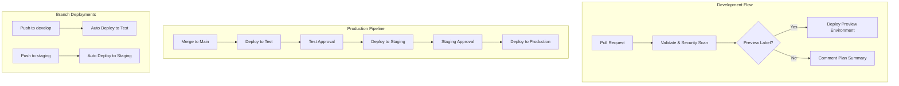

# Secure CI/CD Pipeline Infrastructure

A comprehensive, security-hardened CI/CD pipeline using Terraform and GitHub Actions to deploy AWS infrastructure with automated security scanning, cost monitoring, and multi-environment deployment workflows.

## 🏗️ Architecture Overview

This infrastructure deploys a secure, scalable web application with:

- **🌐 Network Security**: Multi-AZ VPC with public/private subnet isolation
- **🛡️ Edge Protection**: AWS WAF with managed rules and rate limiting
- **⚖️ Load Balancing**: Application Load Balancer in public subnets
- **🖥️ Compute**: Hardened EC2 instances in private subnets
- **📊 Monitoring**: CloudWatch alarms with SNS notifications
- **🔄 Automation**: SSM patch management and CI/CD workflows
- **💰 Cost Control**: Infracost integration with threshold monitoring
- **🔒 Security**: Comprehensive security scanning and policy validation

## 📋 Prerequisites

Before getting started, ensure you have:

### Required Tools
- **Terraform** >= 1.6.0
- **AWS CLI** configured with appropriate credentials
- **Git** for version control
- **GitHub account** with repository access

### AWS Requirements
- AWS account with necessary permissions
- S3 bucket for Terraform state storage
- DynamoDB table for state locking
- IAM role for GitHub Actions OIDC authentication

### Local Development Tools (Optional)
```bash
# Install security scanning tools for local development
pip install checkov terraform-compliance

# Install Infracost for local cost analysis
curl -fsSL https://raw.githubusercontent.com/infracost/infracost/master/scripts/install.sh | sh
```

## 🚀 Quick Start

### 1. Repository Setup

1. **Clone the repository:**
   ```bash
   git clone <repository-url>
   cd secure-cicd-pipeline
   ```

2. **Configure GitHub Secrets:**
   - `AWS_ROLE_TO_ASSUME`: IAM role ARN for OIDC authentication
   - `TF_STATE_BUCKET`: S3 bucket name for Terraform state
   - `TF_STATE_LOCK_TABLE`: DynamoDB table for state locking
   - `INFRACOST_API_KEY`: Infracost API key (optional, for cost analysis)

### 2. Local Development Setup

1. **Initialize Terraform:**
   ```bash
   cd terraform
   terraform init -backend-config=backend.hcl
   ```

2. **Configure environment variables:**
   ```bash
   cp terraform.tfvars.example terraform.tfvars
   # Edit terraform.tfvars with your specific values
   ```

3. **Validate configuration:**
   ```bash
   terraform fmt -check
   terraform validate
   ```

4. **Run security scans locally:**
   ```bash
   ./scripts/security-scan.sh
   ```

### 3. Environment-Specific Deployment

Choose your deployment environment:

```bash
# Test environment (cost-optimized)
terraform plan -var-file="environments/test.tfvars"
terraform apply -var-file="environments/test.tfvars"

# Staging environment (production-like)
terraform plan -var-file="environments/staging.tfvars"
terraform apply -var-file="environments/staging.tfvars"

# Production environment (full configuration)
terraform plan -var-file="environments/prod.tfvars"
terraform apply -var-file="environments/prod.tfvars"
```

## 🔄 CI/CD Workflow and Approval Process

### Workflow Overview

The CI/CD pipeline implements a comprehensive deployment strategy with multiple environments and approval gates:



### Pull Request Validation

Every pull request automatically triggers:

1. **🔍 Code Validation**
   - Terraform format check (`terraform fmt`)
   - Terraform syntax validation (`terraform validate`)
   - Configuration validation

2. **🛡️ Security Scanning**
   - **Checkov**: Static security analysis
   - **terraform-compliance**: Policy-as-code validation
   - Blocks deployment on security violations

3. **💰 Cost Analysis**
   - **Infracost**: Infrastructure cost estimation
   - Threshold warnings in PR comments
   - Cost diff analysis vs. baseline

4. **📊 Plan Generation**
   - Terraform plan with resource changes
   - Plan summary in PR comments
   - Artifact upload for review

### Environment Deployment Strategy

#### Test Environment
- **Trigger**: Push to `develop` branch or manual dispatch
- **Approval**: None (automatic deployment)
- **Purpose**: Automated testing and validation
- **Configuration**: Cost-optimized (t3.micro, single instance)

#### Staging Environment  
- **Trigger**: Push to `staging` branch or promotion from test
- **Approval**: Required (1 DevOps team member)
- **Purpose**: Pre-production validation and UAT
- **Configuration**: Production-like (t3.small, multi-instance)

#### Production Environment
- **Trigger**: Merge to `main` branch
- **Approval**: Required (2 senior DevOps team members)
- **Purpose**: Live customer-facing application
- **Configuration**: Full production (t3.small+, enhanced monitoring)

### Preview Environments

For feature branch testing:

1. **Create Preview**: Add `preview` label to PR
2. **Automatic Deployment**: Creates isolated environment
3. **Testing**: Access via commented ALB URL
4. **Cleanup**: Automatic destruction on PR closure

### Approval Process

#### Staging Deployment Approval
- **Required Reviewers**: 1 DevOps team member
- **Criteria**: Test environment success + manual validation
- **Timeout**: 24 hours

#### Production Deployment Approval
- **Required Reviewers**: 2 senior DevOps team members
- **Criteria**: Staging environment success + change management review
- **Timeout**: 72 hours
- **Additional Requirements**:
  - Security review for infrastructure changes
  - Change management documentation
  - Rollback plan verification

## ✅ Verification Steps for Deployed Infrastructure

### 1. Infrastructure Health Checks

After deployment, verify infrastructure components:

```bash
# Get deployment outputs
terraform output

# Verify ALB is accessible
curl -I http://$(terraform output -raw application_url)

# Check EC2 instance health
aws ec2 describe-instance-status --instance-ids $(terraform output -json instance_ids | jq -r '.[]')

# Verify WAF is active
aws wafv2 get-web-acl --scope REGIONAL --id $(terraform output -raw waf_web_acl_id)
```

### 2. Security Validation

Verify security configurations:

```bash
# Check IMDSv2 enforcement
aws ec2 describe-instances --instance-ids $(terraform output -json instance_ids | jq -r '.[]') \
  --query 'Reservations[].Instances[].MetadataOptions'

# Verify EBS encryption
aws ec2 describe-volumes --filters "Name=attachment.instance-id,Values=$(terraform output -json instance_ids | jq -r '.[]')" \
  --query 'Volumes[].Encrypted'

# Check security group rules
aws ec2 describe-security-groups --group-ids $(terraform output -raw alb_security_group_id)
```

### 3. Network Connectivity Tests

Validate network configuration:

```bash
# Test ALB connectivity
curl -v http://$(terraform output -raw application_url)

# Verify private subnet isolation (should fail)
# EC2 instances should not be directly accessible

# Test VPC endpoints
aws ssm describe-instance-information --filters "Name=InstanceIds,Values=$(terraform output -json instance_ids | jq -r '.[]')"
```

### 4. Monitoring Validation

Verify monitoring setup:

```bash
# Check CloudWatch alarms
aws cloudwatch describe-alarms --alarm-names $(terraform output -json alarm_names | jq -r '.[]')

# Verify SNS topic subscriptions
aws sns list-subscriptions-by-topic --topic-arn $(terraform output -raw sns_topic_arn)

# Test alarm notifications (simulate)
aws cloudwatch set-alarm-state --alarm-name $(terraform output -raw ec2_status_check_alarm_name) \
  --state-value ALARM --state-reason "Testing alarm notification"
```

## 🧪 Testing and Simulating Monitoring Alarms

### CloudWatch Alarm Testing

#### 1. EC2 Status Check Alarm
```bash
# Simulate instance failure
aws cloudwatch set-alarm-state \
  --alarm-name "$(terraform output -raw project_name)-$(terraform output -raw env)-ec2-status-check" \
  --state-value ALARM \
  --state-reason "Simulated instance failure for testing"

# Reset alarm
aws cloudwatch set-alarm-state \
  --alarm-name "$(terraform output -raw project_name)-$(terraform output -raw env)-ec2-status-check" \
  --state-value OK \
  --state-reason "Test completed - resetting alarm"
```

#### 2. High CPU Utilization Alarm
```bash
# Generate CPU load on EC2 instance (connect via SSM)
aws ssm start-session --target $(terraform output -json instance_ids | jq -r '.[0]')

# In the SSM session, run:
# stress --cpu 4 --timeout 300s  # Requires stress tool installation

# Monitor alarm state
aws cloudwatch describe-alarms --alarm-names "$(terraform output -raw project_name)-$(terraform output -raw env)-ec2-high-cpu"
```

#### 3. ALB 5xx Error Alarm
```bash
# Generate 5xx errors (requires application modification or load testing)
# Use load testing tools like Apache Bench or Artillery

# Monitor ALB metrics
aws cloudwatch get-metric-statistics \
  --namespace AWS/ApplicationELB \
  --metric-name HTTPCode_Target_5XX_Count \
  --dimensions Name=LoadBalancer,Value=$(terraform output -raw alb_arn_suffix) \
  --start-time $(date -u -d '1 hour ago' +%Y-%m-%dT%H:%M:%S) \
  --end-time $(date -u +%Y-%m-%dT%H:%M:%S) \
  --period 300 \
  --statistics Sum
```

### SNS Notification Testing

```bash
# Test SNS topic directly
aws sns publish \
  --topic-arn $(terraform output -raw sns_topic_arn) \
  --message "Test notification from infrastructure monitoring" \
  --subject "Infrastructure Alert Test"

# Verify email delivery
# Check configured email addresses for test notification
```

### Patch Management Testing

```bash
# Check patch compliance
aws ssm describe-instance-patch-states --instance-ids $(terraform output -json instance_ids | jq -r '.[]')

# View patch baseline
aws ssm describe-patch-baselines --filters "Key=Name,Values=$(terraform output -raw patch_baseline_name)"

# Manually trigger patch scan
aws ssm send-command \
  --document-name "AWS-RunPatchBaseline" \
  --parameters "Operation=Scan" \
  --targets "Key=tag:PatchGroup,Values=$(terraform output -raw patch_group_name)"
```

## 🧹 Cleanup and Destruction Procedures

### Environment-Specific Cleanup

#### Preview Environment Cleanup (Automatic)
Preview environments are automatically cleaned up when PRs are closed, but manual cleanup is also possible:

```bash
# List preview workspaces
terraform workspace list

# Select and destroy preview environment
terraform workspace select preview-feature-branch-name
terraform destroy -var-file="environments/preview.tfvars" -auto-approve
terraform workspace select default
terraform workspace delete preview-feature-branch-name
```

#### Test Environment Cleanup
```bash
# Destroy test environment
terraform workspace select test
terraform destroy -var-file="environments/test.tfvars"
```

#### Staging Environment Cleanup
```bash
# Destroy staging environment (requires approval)
terraform workspace select staging
terraform destroy -var-file="environments/staging.tfvars"
```

#### Production Environment Cleanup
```bash
# ⚠️  CRITICAL: Production cleanup requires senior approval
# Ensure proper backup and change management procedures

terraform workspace select prod
terraform plan -destroy -var-file="environments/prod.tfvars"
# Review destroy plan carefully
terraform destroy -var-file="environments/prod.tfvars"
```

### Complete Infrastructure Cleanup

```bash
# Clean up all environments (use with extreme caution)
for env in test staging prod; do
  echo "Cleaning up $env environment..."
  terraform workspace select $env
  terraform destroy -var-file="environments/${env}.tfvars" -auto-approve
done

# Clean up preview environments
terraform workspace list | grep preview | while read workspace; do
  terraform workspace select $workspace
  terraform destroy -auto-approve
  terraform workspace select default
  terraform workspace delete $workspace
done

# Return to default workspace
terraform workspace select default
```

### Backup Verification Before Cleanup

```bash
# Verify backups exist (if applicable)
aws s3 ls s3://$(terraform output -raw backup_bucket_name)/ --recursive

# Export important configuration
terraform show -json > infrastructure-backup-$(date +%Y%m%d).json

# Save state file backup
aws s3 cp s3://$(terraform output -raw state_bucket_name)/$(terraform output -raw state_key) \
  ./terraform-state-backup-$(date +%Y%m%d).tfstate
```

## 🔧 Troubleshooting Guide

### Common Issues and Solutions

#### 1. Terraform State Lock Issues
```bash
# Check lock status
aws dynamodb get-item --table-name terraform-state-lock \
  --key '{"LockID":{"S":"terraform-state-bucket/path/to/state"}}'

# Force unlock (use with caution)
terraform force-unlock <lock-id>
```

#### 2. Security Scan Failures
```bash
# Run local security scan
cd terraform
./scripts/security-scan.sh

# Fix common Checkov issues:
# - Add IMDSv2 configuration to EC2 instances
# - Enable EBS encryption
# - Restrict security group rules

# Fix terraform-compliance issues:
# - Review policy files in compliance-policies/
# - Ensure infrastructure meets organizational requirements
```

#### 3. Cost Threshold Warnings
```bash
# Generate local cost estimate
infracost breakdown --path . --format table

# Review cost optimization:
# - Use smaller instance types for test/staging
# - Implement lifecycle policies
# - Clean up unused resources
```

#### 4. Deployment Failures
```bash
# Check GitHub Actions logs
# Review Terraform plan output
# Verify AWS permissions

# Common fixes:
# - Update IAM role permissions
# - Check resource limits
# - Verify network configuration
```

#### 5. Monitoring Issues
```bash
# Check CloudWatch agent status
aws ssm describe-instance-information

# Verify SNS subscriptions
aws sns list-subscriptions-by-topic --topic-arn <topic-arn>

# Test alarm functionality
aws cloudwatch set-alarm-state --alarm-name <alarm-name> --state-value ALARM
```

### Emergency Procedures

#### Production Rollback
```bash
# 1. Identify last known good state
terraform state list

# 2. Revert to previous Terraform configuration
git checkout <previous-commit>

# 3. Apply previous configuration
terraform plan -var-file="environments/prod.tfvars"
terraform apply -var-file="environments/prod.tfvars"

# 4. Verify rollback success
curl -I http://$(terraform output -raw application_url)
```

#### Security Incident Response
```bash
# 1. Immediately isolate affected resources
aws ec2 modify-instance-attribute --instance-id <instance-id> --no-source-dest-check

# 2. Enable detailed logging
aws logs create-log-group --log-group-name emergency-investigation

# 3. Capture current state
terraform show > incident-state-$(date +%Y%m%d-%H%M).txt

# 4. Contact security team and follow incident response procedures
```

## 📚 Additional Resources

### Documentation Links
- [Terraform Documentation](https://www.terraform.io/docs)
- [AWS Provider Documentation](https://registry.terraform.io/providers/hashicorp/aws/latest/docs)
- [GitHub Actions Documentation](https://docs.github.com/en/actions)
- [Checkov Security Scanning](https://www.checkov.io/)
- [terraform-compliance](https://terraform-compliance.com/)
- [Infracost](https://www.infracost.io/docs/)

### Project-Specific Documentation
- [Security Scanning Guide](terraform/SECURITY.md)
- [Cost Monitoring Setup](terraform/COST_MONITORING.md)
- [Tagging Strategy](terraform/TAGGING.md)
- [Security Scanning Script](terraform/SECURITY_SCANNING.md)

### Support and Contacts
- **DevOps Team**: devops@company.com
- **Security Team**: security@company.com
- **Emergency Contact**: oncall@company.com

---

## 🏷️ Environment Configurations

| Environment | Purpose | Instance Type | Monitoring | Budget | Approval Required |
|-------------|---------|---------------|------------|--------|-------------------|
| **Test** | Automated testing | t3.micro | Basic | $25/month | None |
| **Staging** | Pre-production validation | t3.small | Enhanced | $75/month | DevOps team |
| **Production** | Live application | t3.small+ | Full | $150/month | Senior team |
| **Preview** | Feature branch testing | t3.micro | Basic | $15/month | None |

---

*This infrastructure follows AWS Well-Architected Framework principles with emphasis on security, reliability, and operational excellence.*
